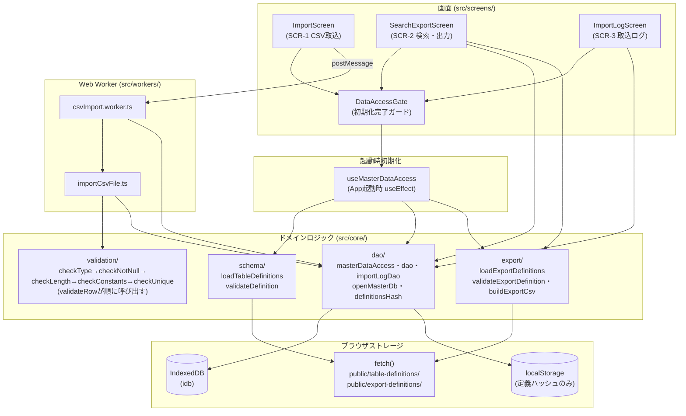
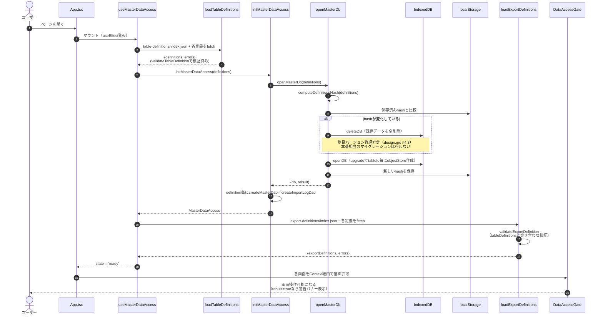
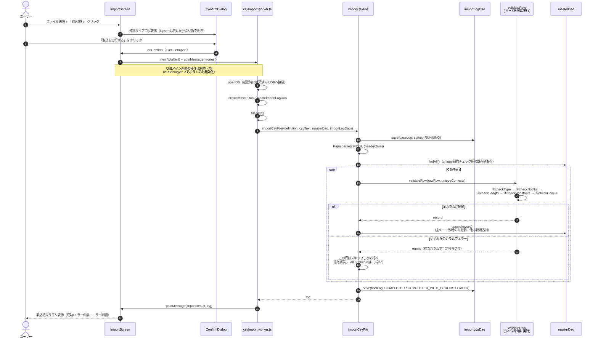
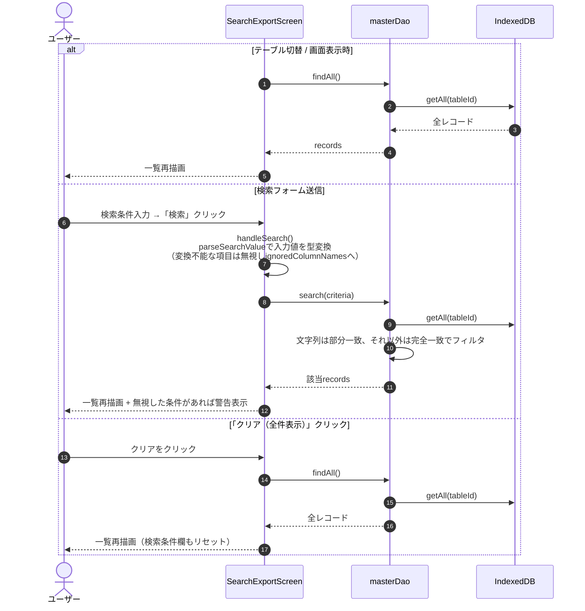
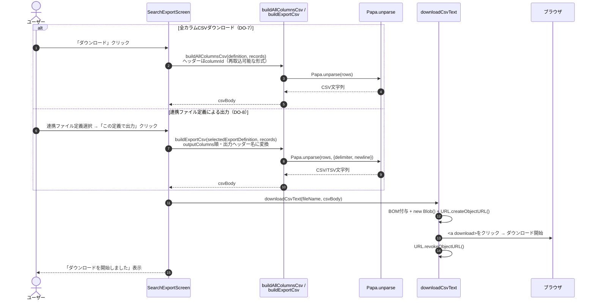
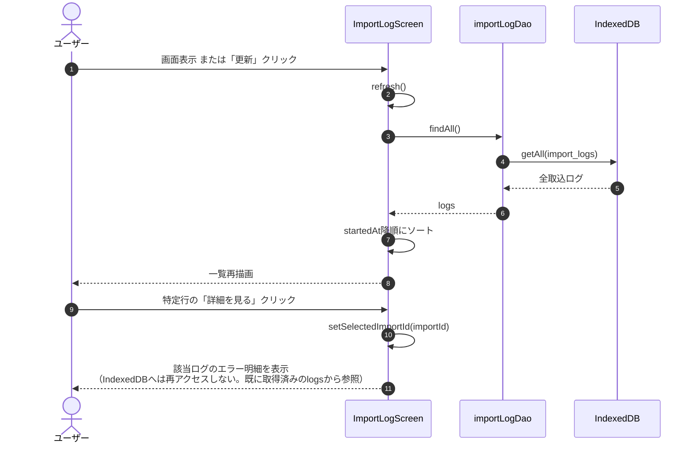

# プログラムフロー図

このドキュメントは、実装済みのマスタ管理システムPoCを俯瞰するための図をまとめたもの。
1つ目は全体のモジュール構成（静的な依存関係）、2つ目以降はフロントエンドで操作イベントが
発火してからモジュールがどの順序で呼び出されていくか（動的な呼び出し順）を示す。

一次資料ではなく、実装（`src/`配下）から起こした参考資料。実装を変更した場合はこの図も
あわせて更新すること。インタラクティブに呼び出し順を1ステップずつアニメーション表示する
版が [program-flow.html](./program-flow.html) にある（ブラウザで直接開いて確認できる）。

## 目次

1. [全体構成（俯瞰図）](#1-全体構成俯瞰図)
2. [アプリ起動時の初期化](#2-アプリ起動時の初期化)
3. [CSV取込（SCR-1）](#3-csv取込scr-1)
4. [マスタ検索（SCR-2）](#4-マスタ検索scr-2)
5. [CSVダウンロード・連携ファイル出力（SCR-2）](#5-csvダウンロード連携ファイル出力scr-2)
6. [取込実行ログ表示（SCR-3）](#6-取込実行ログ表示scr-3)

---

## 1. 全体構成（俯瞰図）

画面（`src/screens/`）は`core/`配下のロジックのみを通じてIndexedDBにアクセスし、CSV取込だけは
Web Worker（`src/workers/`）上で完結する。画面やWorkerが`idb`を直接叩くことはない
（CLAUDE.md「コーディング上の注意」）。

---

## 2. アプリ起動時の初期化

**発火イベント**: ページ読み込み（`App`のマウント）

`src/useMasterDataAccess.ts`の`useEffect`が起点。この完了前は`DataAccessGate`が
全画面の操作をブロックする（`docs/design.md` §4.8）。

---

## 3. CSV取込（SCR-1）

**発火イベント**: 「取込実行」ボタン押下 → 確認ダイアログで「取込を実行する」を確定

パース・バリデーション・Upsert登録は全てメインスレッドをブロックしないWeb Worker
（`csvImport.worker.ts`）側で行う（DO-3）。バリデーションは要求仕様書§5.2の
①型→②NotNull→③長さ→④定数→⑤ユニークの順序を厳守する。

---

## 4. マスタ検索（SCR-2）

**発火イベント**: テーブル切替（マウント時含む）／検索フォーム送信／「クリア（全件表示）」押下

---

## 5. CSVダウンロード・連携ファイル出力（SCR-2）

**発火イベント**: 「ダウンロード」（全カラムCSV）／「この定義で出力」（連携ファイル定義）押下

DO-7（画面表示中の検索結果をそのままCSVへ）とDO-8（決められた連携先フォーマットへ変換して
出力）は別のボタン・別の変換ロジック（`buildAllColumnsCsv` / `buildExportCsv`）だが、
最終的なファイルダウンロード処理（`downloadCsvText`）は共通。

---

## 6. 取込実行ログ表示（SCR-3）

**発火イベント**: 画面表示（マウント時）／「更新」押下／「詳細を見る」押下

